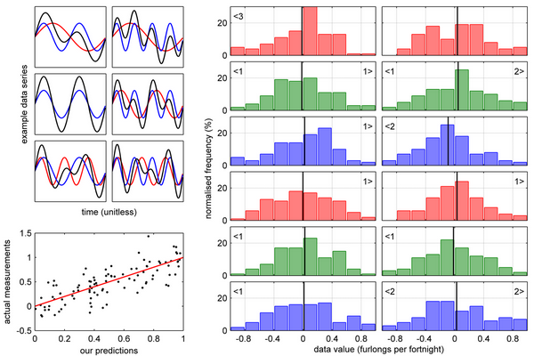

# Panel

## Acknowledgement
This repository is merely a backup of the magnificent Panel toolbox for Matlab by Ben Mitch which can be found at https://nl.mathworks.com/matlabcentral/fileexchange/20003-panel.

## Overview

Panel is an alternative to Matlab's "subplot", providing easier control over layout (particularly, easy elimination of whitespace). It also fixes dashed/dotted lines during export to image files (both vector and bitmap formats).
If you find the layouts generated by subplot() have too much space and not enough axis, try Panel. If you find it tedious to construct subplot layouts that are more complex than a simple grid, try Panel. If you always resort to other software to prepare your final figures for publication because you can't get the appearance you want from Matlab, try Panel.
Panel was designed to produce output for print publications directly from Matlab. Layouts are, by default, in physical units (mm, by default), and exporting to a graphics file targets print columns directly. However, it performs equally well if the end goal is digital display, providing easy control over use of screen real estate.

Panel incorporates features suggested by several Matlab Central users, as well as some code - see the documentation for details.

Questions? Please see the http://www.mathworks.co.uk/matlabcentral/fileexchange/20003-panel/content/docs/faq.html first.

NB: Release 2.11 is required for all functions to work correctly at and beyond Matlab R2014b.

Cite As
Ben Mitch (2020). Panel (https://www.mathworks.com/matlabcentral/fileexchange/20003-panel), MATLAB Central File Exchange. Retrieved November 19, 2020.

